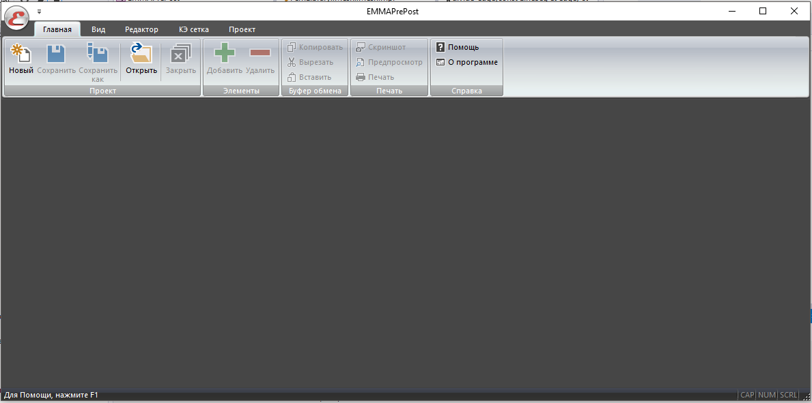
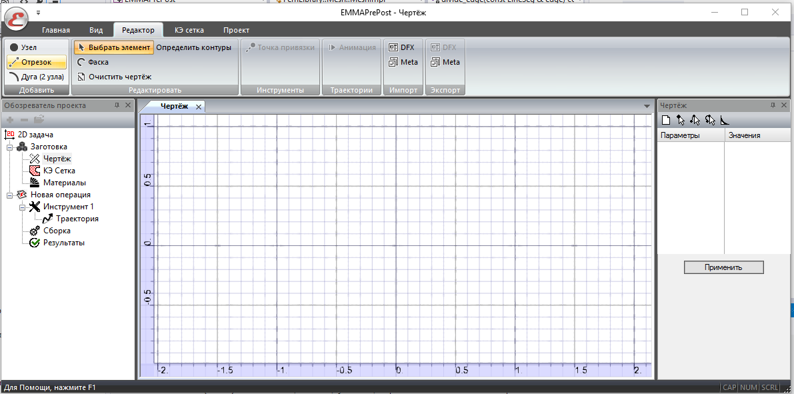
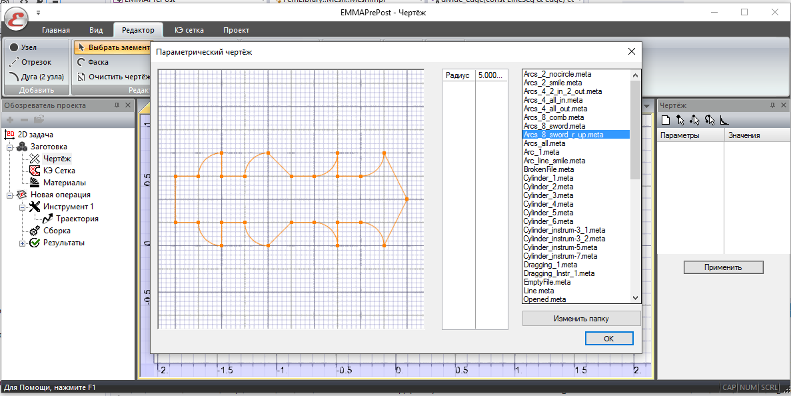
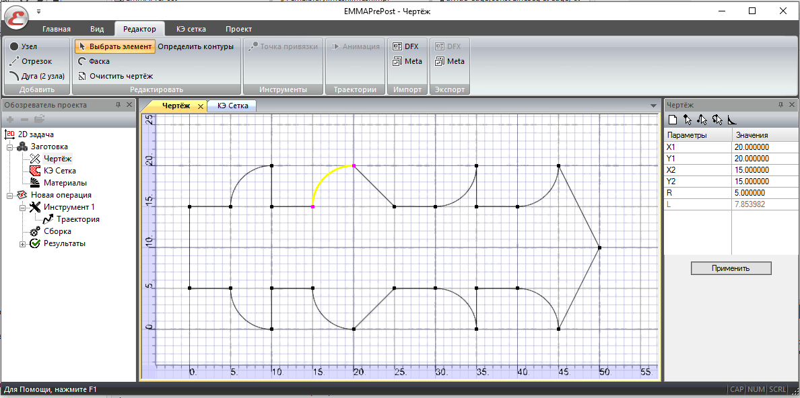
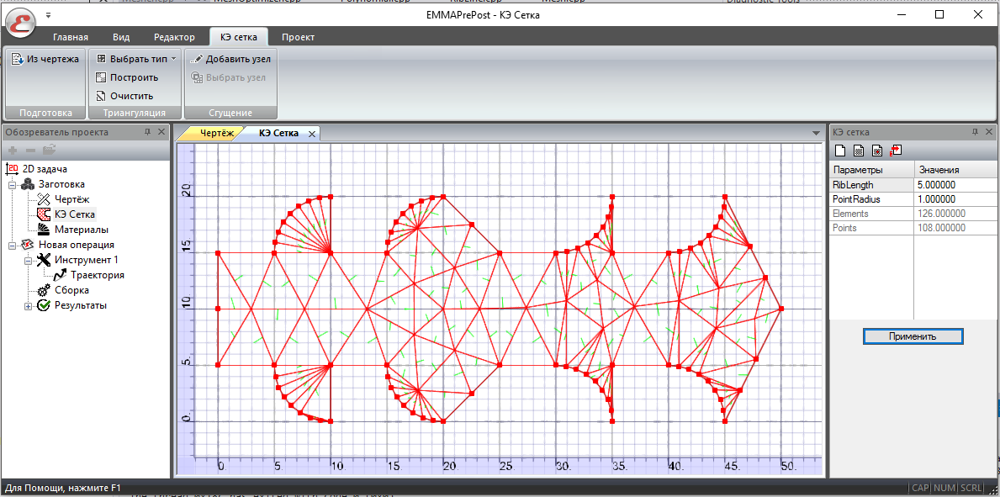
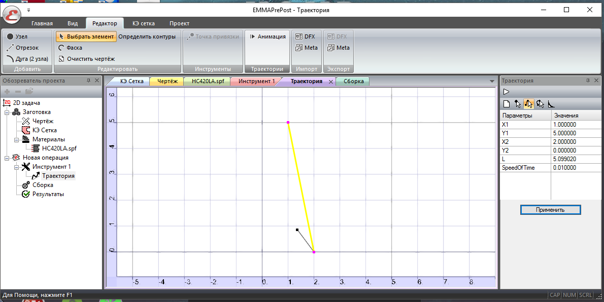
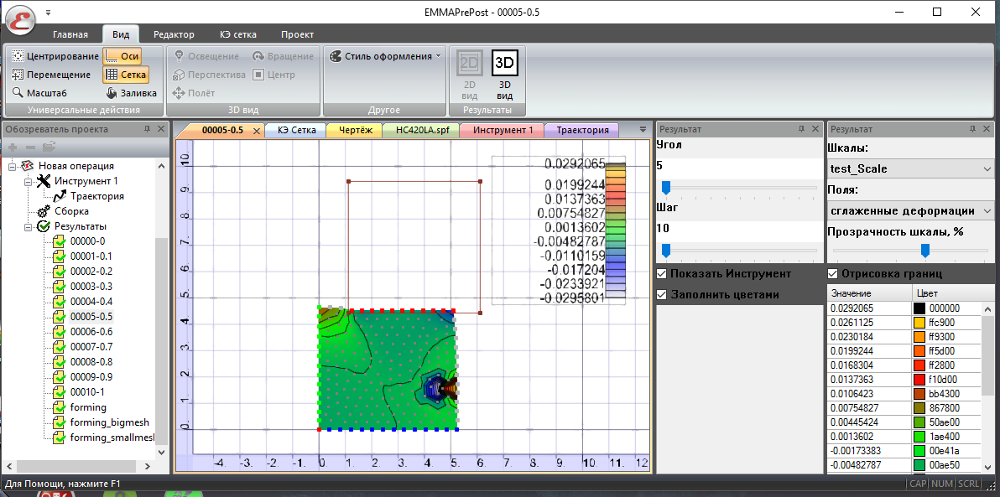

# emma
Extended Mathematical Modeling Application

Including 2 projects: 
- **EmmaPrePost** for setting up workpiece, instruments, their trajectories and final results;
- **EmmaSrv** for calculations.

## Screenshots:

